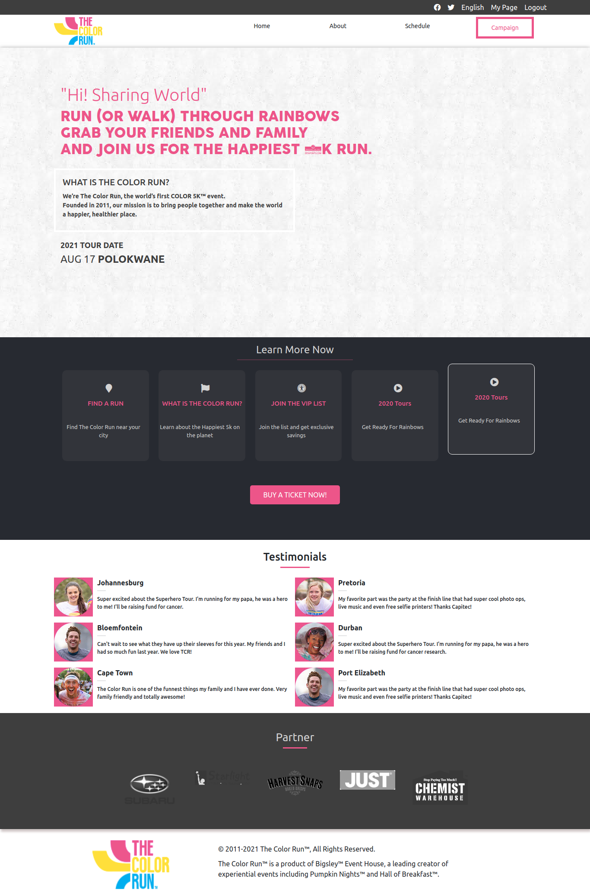
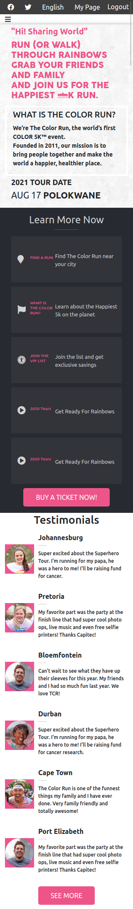

# The COLOR RUN , CAPSTONE PROJECT ONE.

> Responsive Conference/Event web page.

| Homepage | Search result page| 
| --- | --- |
|  | 

## Built With

- HTML & CSS
- Bootstrap 5
- Scss

## Live Demo

[Live Demo Link](https://tanzila-abedin.github.io/The-Color-Run/.)

## Requirements

1. Nodejs for the linters and the sass compiler

## Getting Started 
To get a local copy up and running follow these simple example steps.

1. Go to https://github.com/tanzila-abedin/The-Color-Run
2. Click on the code and copy the HTML code.
3. Use terminal to clone this repository on your local machine.
4. Run `git checkout -b your-branch-name`. Make your contributions
5. Push your branch up to your forked repository
6. Open a Pull Request with a detailed description of the development branch of the original project for a review

## Run tests
npx hint . is used fot HTML & npx stylelint "**/*.{css,scss}" is used for CSS.

## Authors

👤 **Tanzila**

- GitHub: [@githubhandle](https://github.com/tanzila-abedin)
- Twitter: [@twitterhandle](https://twitter.com/TanzilaAbedin)
- LinkedIn: [LinkedIn](https://www.linkedin.com/in/tanzila-abedin-331440b2/)

## 🤝 Contributing

Contributions, issues, and feature requests are welcome!

Feel free to check the [issues page](issues/).

## Show your support

Give a ⭐️ if you like this project!

## Acknowledgments
- Design idea by [Cindy Shin in Behance](https://www.behance.net/adagio07)

## 📝 License

This project is [CreativeCommons](https://creativecommons.org/licenses/by-nc/4.0/) licensed.
